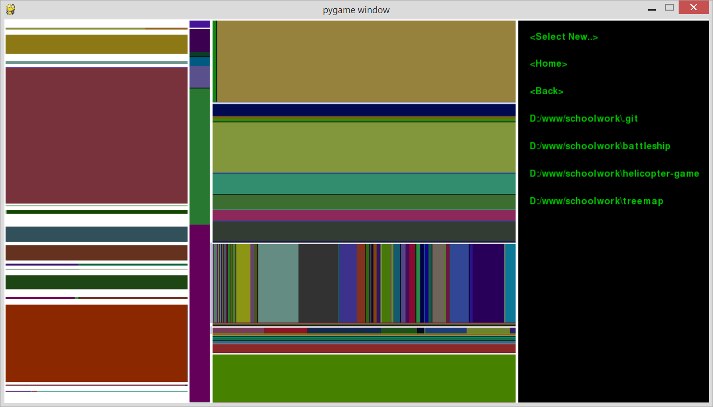

## TreeMap

A [Treemapping](https://en.wikipedia.org/wiki/Treemapping) program in Python built using PyGame

#### Treemaps
Definition: Treemaps display hierarchical (tree-structured) data as a set of nested rectangles.

#### Dependency
* python 2.7
* [pygame module](http://www.pygame.org/download.shtml)

#### Features
* Drill down into sub-folders (right-side menu) to update the treemap realtime

#### Screenshots

